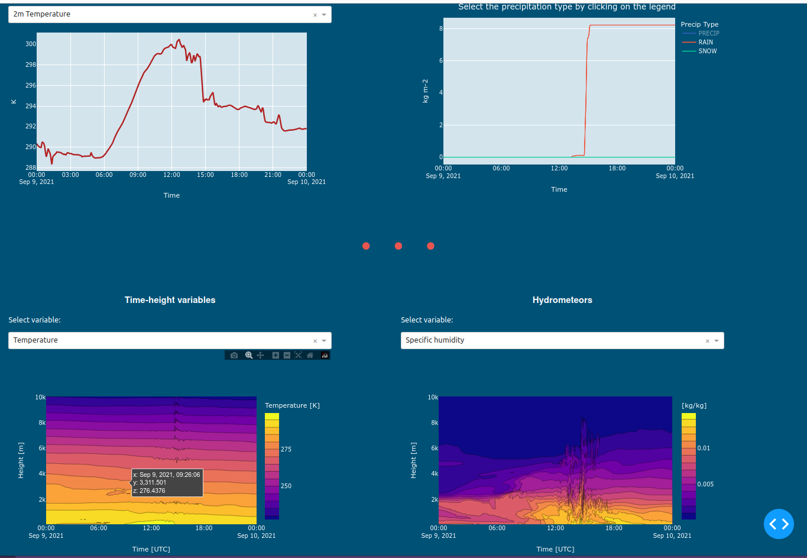

# ICON Cologne Dashboard 

This data dashboard enables a quickly looking at ICON data which is provided as netcdf as a meteogram. 
Below an example of how the dashboard looks is shown. The dashboard can be easily configured to look into a certain set of data using either the window to write a path or by setting a path in the assets/config.toml file.

